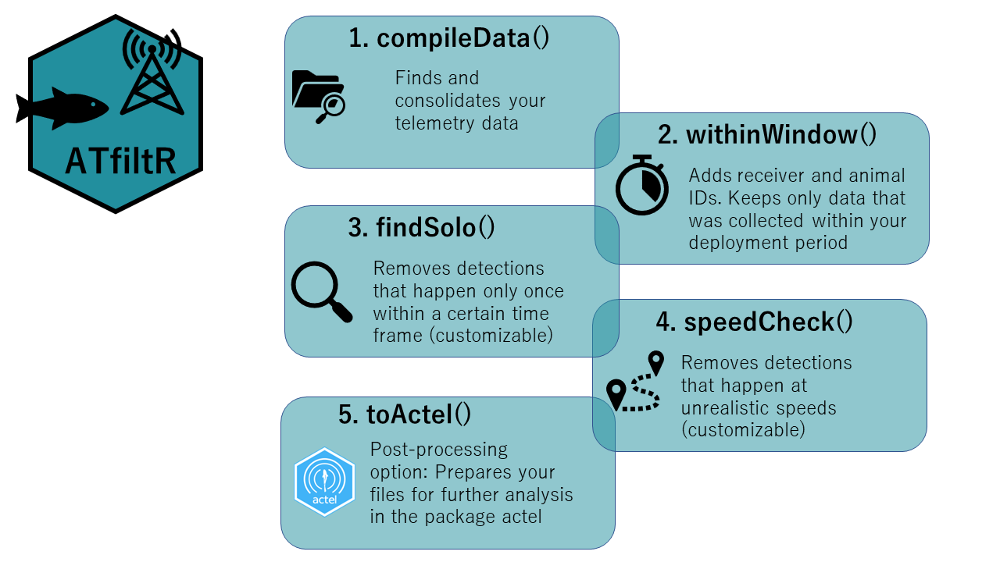

<!-- README.md is generated from README.Rmd. Please edit that file -->

# ATfiltR

<!-- badges: start -->

<!-- badges: end -->

## Overview

**ATfiltR** is one solution for:  
- compiling your acoustic telemetry detection files  
- removing duplicates (and saving them elsewhere)  
- attributing animal ID and location attributes to detections (and
saving tags that don’t belong to you elsewhere)  
- removing detections which fall outside of the deployment period (and
saving them elsewhere)  
- filtering ghost detections via a (customizable) “solitary detections”
filter (and saving them elsewhere)  
- filtering ghost detections via a (customizable) “swimming speed”
filter (and saving them elsewhere)

It is meant as an automatic way to process a lot of data and filter
detections in bulk, based on set rules (e.g. speed) and with limited
user input (i.e. you will not choose what detections are to be kept or
erased each time an irregularity is found). We designed ATfiltR to be a
little “formatting” intensive for the user, and we are hopeful that
using it is straightforward for all.

Finer, fully user interactive filtering (and other cool stuff) is
available in the package [actel](https://github.com/hugomflavio/actel),
and we provide here a function that allows you to prepare data that you
processed in ATfiltR for basic use in actel (to save you the headache of
reformatting everything).



## Installation

You can install the development version of ATfiltR from
[GitHub](https://github.com/) with:

``` r
#install.packages("remotes") ##If remotes is not already installed
remotes::install_github("FelicieDh/ATfiltR", build_opts = c("--no-resave-data", "--no-manual"), build_vignettes = TRUE) 
```

If this doesn’t work, you may also use with build_vignettes = FALSE:

``` r
#install.packages("remotes") ##If remotes is not already installed
remotes::install_github("FelicieDh/ATfiltR", build_opts = c("--no-resave-data", "--no-manual"), build_vignettes = FALSE) 
```

## Using ATfiltR

You will need to get an [RStudio
Project](https://support.rstudio.com/hc/en-us/articles/200526207-Using-RStudio-Projects)
set up, and to store your data inside it.

We **strongly** recommend that you read the vignettes, they are the
package’s manual!

``` r
browseVignettes("ATfiltR")
```
