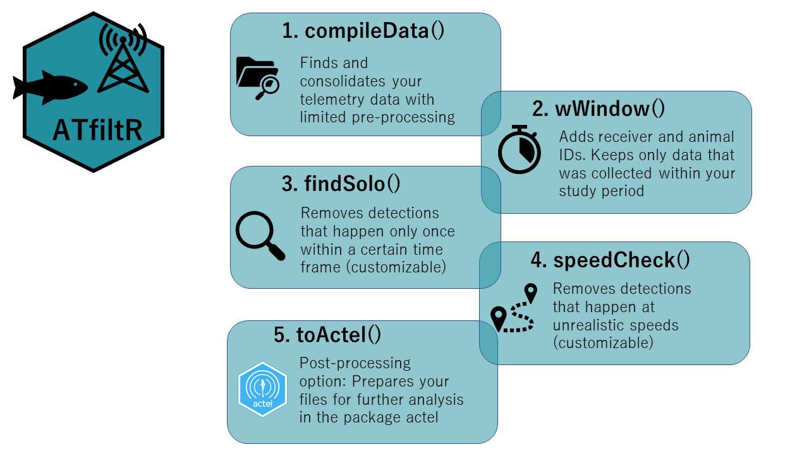

<!-- README.md is generated from README.Rmd. Please edit that file -->

# ATfiltR

<!-- badges: start -->
<!-- badges: end -->

## Overview

**ATfiltR** is one solution for:  
- compiling your acoustic telemetry detection files  
- removing duplicates (and save them elsewhere)  
- attributing animal ID to detections (and save tags that don’t belong
to you elsewhere)  
- removing detections which fall outside of the deployment period  
- filtering ghost detections via a (customizable) “solitary detections”
filter  
- filtering ghost detections via a (customizable) “swimming speed filter

It is meant as an automatic way to process a lot of data and filter
detections in bulk, based on set rules (e.g. speed) and with limited
user input (i.e. you will not choose what detections are to be kept or
erased each time an irregularity is found). Finer, fully user
interactive filtering (and other cool stuff) is available on the package
[actel](https://github.com/hugomflavio/actel), and we provide here a
function that allows you to prepare data that you processed in ATfiltR
for basic use in actel.



## Installation

You can install the development version of ATfiltR from
[GitHub](https://github.com/) with:

``` r
# install.packages("devtools")
devtools::install_github("FelicieDh/ATfiltR")
```
