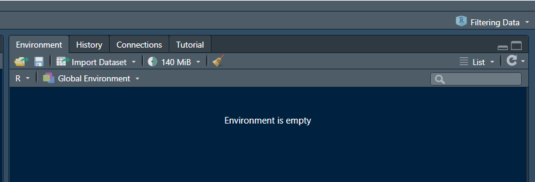

```{r, include = FALSE}
knitr::opts_chunk$set(
  collapse = TRUE,
  comment = "#>"
)
```

Welcome to **ATfiltR**. 
This tool is meant to be as easy as possible to use and we hope that getting started with it will be easy peasy.

<br />
<br />

## RStudio Project  
The most important thing to know about ATfiltR is that it is **project based**. 

This means that you do **not** have to define a working directory (setwd()), we find these to be a headache especially if you work collaboratively or on multiple computers.

Instead, all you have to do is to create an [RStudio Project](https://support.rstudio.com/hc/en-us/articles/200526207-Using-RStudio-Projects), and all the ATfiltR magic will happen within this project, no matter on which machine the project is being used.


<br />
```{r, out.width = "600px", echo=F}

```  

*You can create a project in a new or in an existing directory, the name does not matter*

<br />
<br />

Once your project is created (*you can name it anything you want*), you will need to put all the data you wish to use in a folder within the project directory. That way ATfiltR can find it. Below is an example of what this looks like.

<br />

```{r, out.width = "600px", echo=F}

```  

*Here, I created a folder that contains my raw telemetry files "Detections" in the project folder*


<br />
<br />

To work with ATfiltR, you'll have to make sure that your project is opened in R. You can see that on the top right of the R studio window. 

To open your project in R and get started you can "open project" from the R Studio console, or simply double click on the "project cube" icon in your project directory (see image above).

<br />
```{r, out.width = "600px", echo=F}

```  

*On the top right, I can tell that my project is opened*

<br />
<br />

**Your project is all set, and your telemetry data is stored in a folder within it?**  
You are ready to go!

First stop: compileData()
